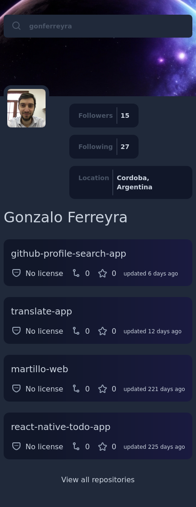
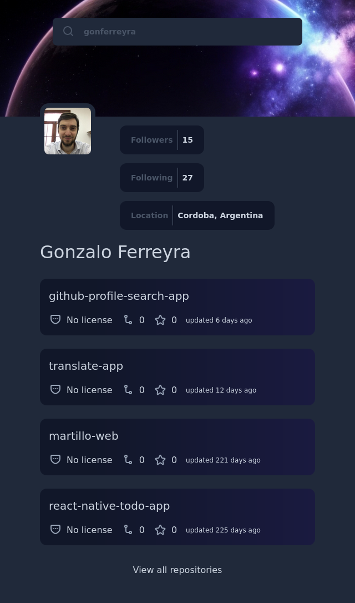
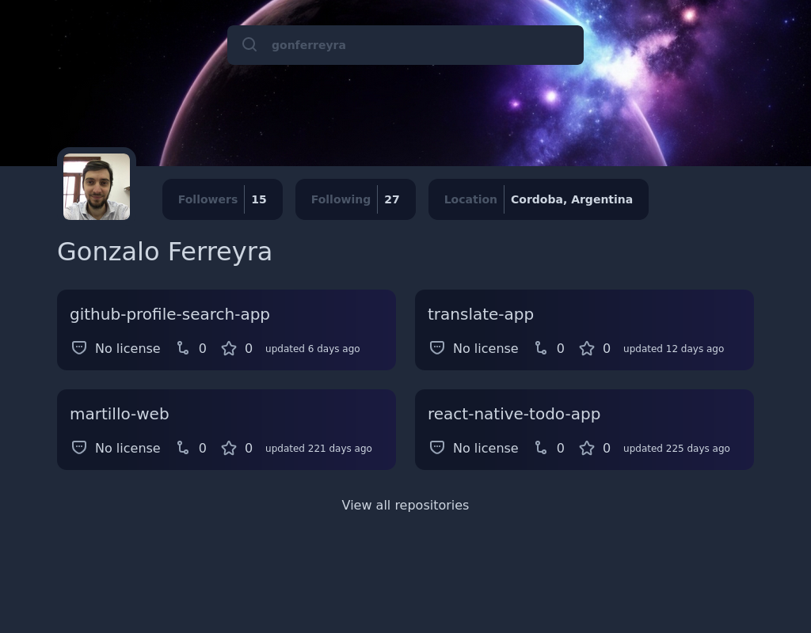
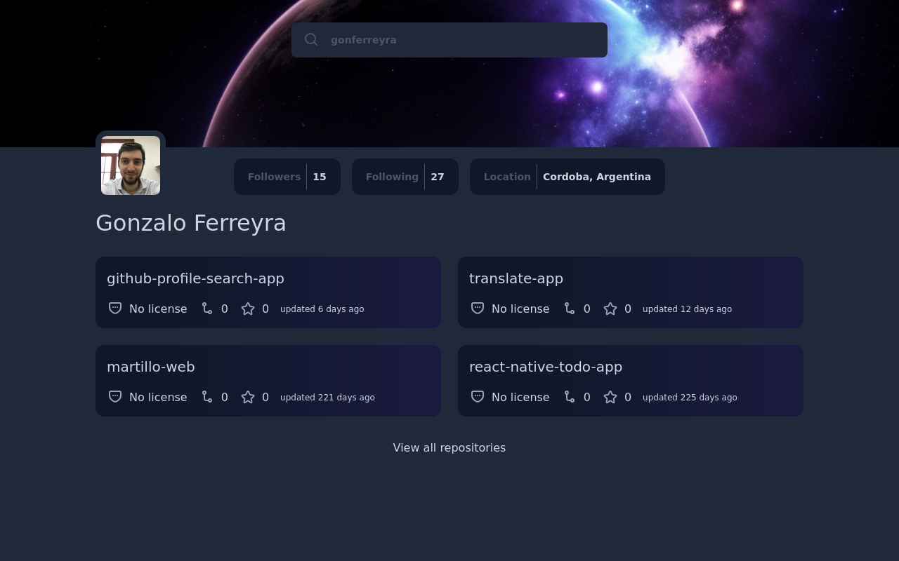
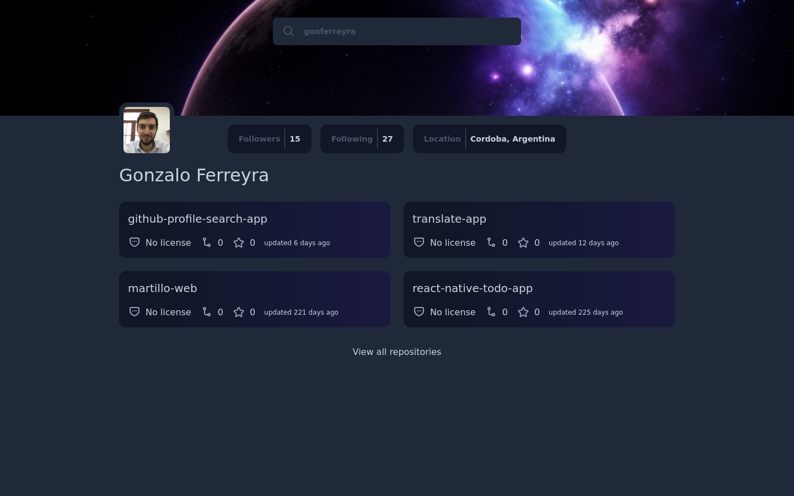

# GitHub Profile Search App

## Table of Contents

- [GitHub Profile Search App](#github-profile-search-app)
  - [Table of Contents](#table-of-contents)
  - [Challenge](#challenge)
  - [Solution](#solution)
    - [Demo](#demo)
    - [Screenshots](#screenshots)
    - [Build With](#build-with)
  - [How To Use](#how-to-use)

## Challenge

The challenge requires creating a Github Profile search application that utilizes multiple API endpoints. The Github Profile search app requires the use of multiple APIs, such as the Github REST API, which returns information about a repository as a JSON.

User Stories:

- Create a Github profile page that matches the given design.

- Use HTML to create the basic structure.

- Add inputs, images, buttons, and other elements according to the design.

- Use JavaScript to add interactivity.

- Users should be able to search for user by user name.

- User should be able to see the number of followers, following, and location.

- User should be able to see the repositories that profile has.

- User should be able to see the details of each repository.

- When users select repository card, they should be able to see the repository page in the new tab.

- The page should be responsive on different screen sizes.

- Deploy the solution and submit Repository URL and Demo URL.

## Solution

### Demo

The site is hosted [here](https://github-profile-search-app.vercel.app/)

### Screenshots

430px - Mobile



624px - Mobile



1024px - Desktop



1280px - Large Desktop



1440px - Large Desktop



### Build With

The technologies used for this application were React with Typescript. Tailwind was used for styling. React-Query to retrieve data with caching. Global states are managed through the contextApi.-

## How To Use

To clone and run this application, you'll need [Git](https://git-scm.com) and [yarn](https://yarnpkg.com/). From your command line:

```bash
# Clone this repository
$ git clone git@github.com:gonferreyra/github-profile-search-app.git

# Install dependencies
$ npm install

# Run the app
$ npm run dev
```
